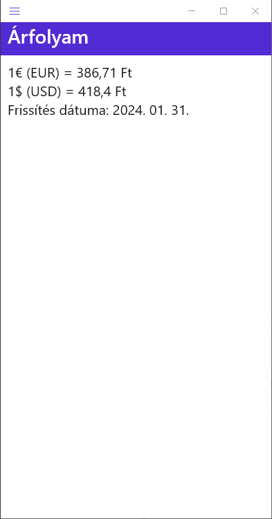

# Hírolvasó App kiegészítése

Az elkezdett Hírolvasó MAUI alkalmazást kell kiegészíteni 3 új oldallal: Árfolyam, Időjárás, Névnap. Az adatokat a mellékelt publikus API végpontok segítségével lehet elérni. Az elkészült oldalak tükrözzék a mellékelt képernyőképeket, de egészítsék ki bátran grafikus elemekkel, hogy látványos eredmények készüljenek.

A feladat végrehajtásának javasolt sorrendje:
1.	Model osztály készítése a Models mappában, az API által kapott JSON adat alapján.
2.	Oldal (ContentPage - XAML) hozzáadása a Views mappához, menüpont készítése az AppShell fájlban.
3.	XAML oldal megtervezése példa adatokkal, adatkötés nélkül.
4.	ViewModel osztály készítése a ViewModels mappában, ami felhasználja a Model és a Repository objektumot.
5.	BindingContext hozzáadása XAML vagy függőségi injektálás segítségével (MauiProgram.cs)
6.	XAML oldal frissítése adatkötéssel a ViewModel tulajdonságaival.
7.	Tesztelés, kommentek készítése.

## Árfolyam



API végpont (GET): https://infojegyzet.hu/webszerkesztes/php/valuta/api/v1/arfolyam/

Jelenítse meg az alkalmazásban a jelenlegi euró és dollár árfolyamot. A valutákat és a hozzájuk tartozó euró értékeket egy szótárban fogja megkapni az API-tól.

## Időjárás


API végpont (GET): https://api.infojegyzet.hu/idojaras/

Jelenítse meg az alkalmazásban a jelenlegi időjárást az API segítségével. 

## Névnap


API végpont (GET): https://api.nevnapok.eu/ma

Jelenítse meg az alkalmazásban a jelenlegi névnapokat. Ehhez az oldalhoz nem kell Model osztályt készíteni, mert változó az API által visszaadott érték.

Az API által adott eredmény: naptári nap (string) : [ név1, név2 …] (string gyűjtemény)

Tehát egy string változóhoz párba kell állítani egy string tömböt/listát. Erre egyik megoldás 
lehet a Dictionary használata, példa kód a Repository használatra:

```C#
private readonly GenericAPIRepository<Dictionary<string, List<string>>> repository;
```

**Menüpontok**


 